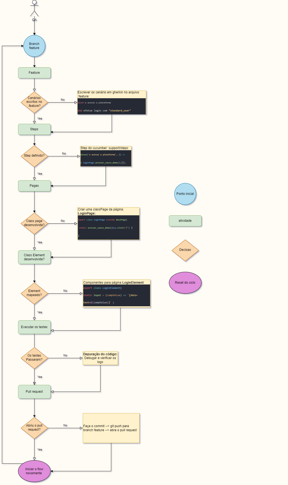

# Acelerador_Cypress_WEB

# Estrutura do framework

    
 

## 1. Integration/spec/.feature:Gherkin

### **Padrão do Gherkin**

  **Given**: Pré-condição, descreve o contexto inicial do cenário,
    para introduzir as ações do cenário.
  O Given não é utilizado para executar ações, apenas colocar em
  um estado conhecido do sistema.

  **Exemplo**
  ~~~gherkin
    Scenario Outline: Filtrar produtos no painel de produtos
      Given efetue login com "standard_user"
  ~~~

  **When**: Etapa do cenário que descreve um evento ou ação. Podendo
  ser uma interação com elemento do sistema, ou um evento acionado
  poro outro sistema.

  **Exemplo**

~~~gherkin
  When filtrar os produtos por "<filtro>"
~~~

  **And**: Maneira para substituir o When, o Given, quando estes tiverem repetições. É para tornar o cenário mais fluído com a substituição de repetição de outros passos.

  **Exemplo**

~~~gherkin
When filtrar os produtos por "<filtro>"
And selecionar o filtro de ordenação
~~~

  **Then**: Utilizado para descrever o resultado esperado do cenário.
  A escrita do Then deve ser como uma afirmação para comparar o resultado,
  real, *que o sistema gerou*, com o resultado esperado *que deveria gerar*.
  *Um resultado deve ser uma saída observável . Ou seja, algo que vem de fora do sistema (relatório, interface de usuário, a mensagem)*

  **Exemplo**

~~~gherkin
    Then deve exibir o produto com nome "Bolsa Av" e preço "R$ 54.55"
~~~
 

**background**: O background é a maneira de contextualizar os cenários. Se você observou que há muita repetição de algum step,
 o background pode ser útil, para introduzir o contexto ao cenário. Nesse sentido, ele define os passos que vão ser feitos para
 iniciar o cenário.

  **Exemplo**

~~~gherkin
      Background: Iniciar na página de exemplo
      Given o acesso a plataforma
~~~
 

**Case de uma loja**

~~~gherkin
  Feature: Filtrar produtos pelo nome e preços

    Background: Iniciar na página de exemplo
      Given o acesso a plataforma

     @test
    Scenario Outline: Filtrar produtos no painel de produtos
      Given efetue login com "standard_user"
      When filtrar os produtos por "Maior preço"
      And selecionar o filtro de ordenação
      Then deve exibir o produto com nome "Bolsa Av" e preço "R$ 54.55"
~~~

 ## 2. steps
 * **arquivo com extensão Step**:
    - é o padrão para o cypress consiga monitorar esse arquivo
      se o nome da pasta é steps, o arquivo deve ter steps também.
    - Cada arquivo steps está integrado ao pageObject: loginSteps; panelSteps

**Padronização:**

`Aspas duplas:` para textos com parâmetros
`Aspas simples:` textos sem parâmetro

~~~javascript
import
import {Before, Given, And} from 'cypress-cucumber-preprocessor/steps'
import {LoginPage} from '../pageObject/pages/LoginPage'

Given(`o acesso a plataforma`, () => {
	LoginPage.acessar_sauce_demo();

});

~~~

  * **common**:
    - hook para controlar as condições que ocorrem antes e depois de cada test

## 3. components

* **componentes**:
    - todos os seletores por meio de classes
    - Cada classe representa a relação de elementos de uma página

  **LoginElement**
~~~javascript
  export class LoginElement{

    static input = (campValue) => `[data-test=${campValue}]`

    static button = (campValue) => `[data-test=${campValue}]`

}
~~~

## 4. pageObject

* **pages**:
  - representa o comportamento de cada página
  - cada arquivo representa uma classe da página

**LoginPage.js**
~~~javascript
import BasePage from './BasePage'
import {LoginElement} from '../components/LoginElement'

export class LoginPage extends BasePage{

    static acessar_sauce_demo(){
        cy.visit('/')
    }

}
~~~

## 5. utils
  * **utils**
    - Parte separada para criar libs, um arquivo uma responsabilidade.
    - fileManager == gerenciar arquivos com leituras e etc.

# Configuração inicial

## 1. VSC
  **Plugins**
  * EditorConfig for VS Code
  * ESLint
  * Draw.io Integration
  * Cucumber (Gherkin)

## 2. instalações
 * npm i --save-dev
 * npm i --production

## 3. Verificação do ambiente
  * Criar um arquivo ou mudar a url do cypress/config/*.json
  * Coloco o nome do arquivo em cypress/plugin/index.js {module.exports --> file}

# Instalação e execução

  * Instalar: `npm i {package_name} -D`.
  * Rodar em modo headless: `npm cy:run`
  * Rodar em tela gráfica: `npm cy:open`
  * Gerar o report HTML(sempre após rodar o cypress): `npm run cy:report`
  * Limpar os reports: `npm run cy:clean`

# Dependências:

  * [**Cypress**](https://www.cypress.io/)
  * [**Cypress-cucumber-preprocessor**](https://github.com/TheBrainFamily/cypress-cucumber-preprocessor)
  * [**Fs-extra**](https://www.npmjs.com/package/fs-extra)
  * [**Rimraf**](https://www.npmjs.com/package/rimraf)
  * [**Multiple-cucumber-html-reporter**](https://www.npmjs.com/package/multiple-cucumber-html-reporter)
  * [**Faker-br**](https://www.npmjs.com/package/faker-br)

  * [**Command**]: **npm i --save-dev {package}**

# Como rodar o projeto pelo docker:

  * docker build -t <nome_da_imagem> .
  * docker container run --rm -it -e tags=@tag -v %cd%:/usr/src/e2e <nome_da_imagem>
  * docker run -i -v "%cd%":/usr/src/e2e -t <nome_da_imagem> --spec cypress/integration/spec/*.feature
  * `O comando acima não funciona no Powershell devido aos dois pontos após %cd%`

  * -it (ativa logs)
  * -e tags=@tag (nome da variável de ambiente ou da tag em sí)
  * -v %cd%:/usr/src/e2e (cria volume entre o container e o pc)

# Configuração do steps do cucumber

 * package.json
 ~~~json
 "cypress-cucumber-preprocessor": {
    "nonGlobalStepDefinitions": false,
    "step_definitions": "cypress/steps",
    "cucumberJson": {
      "generate": true,
      "outputFolder": "reports/json"
    }
  }
 ~~~
 **ponto importante**:
 - "step_definitions": esse atributo irá definir onde estão os steps do projeto, que executam o arquivo em gherkin.
 - se você colocou o nome da pasta steps, os arquivos dentro dela terão que terminar com o {nome-do-arquivo}steps.js

# Eslint Cypress

### Aplicando boas práticas com o eslint

**Fonte**:[eslint-plugin](https://github.com/cypress-io/eslint-plugin-cypress)

**Run** `npm run lint`
